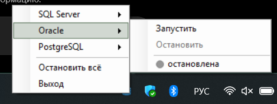

# TrayDB

TrayDB is a lightweight Windows tray utility for starting, stopping and monitoring local database services.

The application is written in Windows PowerShell 5.1 and WinForms. It has no main window, does not connect to databases, does not store passwords and does not require third-party libraries.



## Features

- start and stop database services from the Windows system tray;
- manage several services as one database group;
- start services in the configured order and stop them in reverse order;
- display the current state of every database group;
- stop all configured databases at once;
- enable and disable autostart from the tray menu;
- wait until each service actually reaches `Running` or `Stopped`;
- protect against launching several TrayDB instances;
- create a desktop shortcut;
- run at logon through Task Scheduler with elevated privileges.

## Requirements

- Windows 10 or Windows 11;
- Windows PowerShell 5.1 (`powershell.exe`);
- a local administrator account;
- databases registered as local Windows services.

PowerShell 7 is not the target environment for this project.

## Important before launch

The default configuration expects these exact Windows service names:

```text
MSSQLSERVER
OracleOraDB21Home1TNSListener
OracleServiceORCL
postgresql-x64-17
```

Service names may differ depending on the installed edition, instance name or database version. If TrayDB shows `ошибка / не установлена`, check the actual service names and update `$Script:Databases` in `app.ps1`.

To find likely database services, run:

```powershell
Get-Service |
    Where-Object {
        $_.Name -match 'MSSQL|SQL|Oracle|postgres|MySQL|Maria'
    } |
    Format-Table Status, Name, DisplayName -AutoSize
```

Use the value from `Name`, not `DisplayName`.

## Quick start

Open Windows PowerShell in the project directory and run:

```powershell
Set-ExecutionPolicy -Scope Process -ExecutionPolicy Bypass -Force
& ".\app.ps1"
```

On the first manual launch, Windows will show a UAC prompt. After confirmation, TrayDB starts in a separate hidden process and appears in the system tray.

If the icon is not visible, open the hidden icons area next to the Windows clock.

## Recommended installation

For regular use, place TrayDB in:

```text
C:\Program Files\TrayDB
```

Open Windows PowerShell as administrator in the downloaded project directory and run:

```powershell
$target = Join-Path $env:ProgramFiles 'TrayDB'
New-Item -ItemType Directory -Path $target -Force | Out-Null
Copy-Item -Path .\app.ps1, .\app.ico -Destination $target -Force
```

Then launch the installed copy:

```powershell
powershell.exe -NoProfile -ExecutionPolicy Bypass -File "$env:ProgramFiles\TrayDB\app.ps1"
```

Do not configure autostart while `app.ps1` is still located in `Downloads` or another temporary folder. Task Scheduler stores the absolute path to the script.

## Tray menu

Right-click the TrayDB icon:

```text
SQL Server   ▸  Запустить / Остановить / ● состояние
Oracle       ▸  Запустить / Остановить / ● состояние
PostgreSQL   ▸  Запустить / Остановить / ● состояние
──────────────
Остановить всё
Автозапуск   ▸  Включить / Выключить / ● состояние
Выход
```

When a database submenu opens, TrayDB checks its services immediately and refreshes the state approximately every 2.5 seconds. Polling stops when the menu closes.

Start and stop commands open a separate Windows PowerShell window. The window remains open so the result and any error message can be reviewed.

TrayDB waits up to 60 seconds for each service to reach the requested state before continuing to the next service.

## States

| Indicator | State | Meaning |
|---|---|---|
| 🟢 | работает | all services are `Running` |
| 🟡 | частично запущена | some services are running and some are stopped |
| ⚪ | остановлена | no services are running |
| 🔴 | ошибка / не установлена | a service is missing or is in an unsupported state |

## Configure databases

The database map is located near the beginning of `app.ps1`:

```powershell
$Script:Databases = [ordered]@{
    'SQL Server' = @('MSSQLSERVER')
    'Oracle' = @('OracleOraDB21Home1TNSListener', 'OracleServiceORCL')
    'PostgreSQL' = @('postgresql-x64-17')
}
```

Services are started from left to right. They are stopped in reverse order.

For Oracle, TrayDB starts:

```text
OracleOraDB21Home1TNSListener
OracleServiceORCL
```

To add MySQL, for example:

```powershell
$Script:Databases = [ordered]@{
    'SQL Server' = @('MSSQLSERVER')
    'Oracle' = @('OracleOraDB21Home1TNSListener', 'OracleServiceORCL')
    'PostgreSQL' = @('postgresql-x64-17')
    'MySQL' = @('MySQL80')
}
```

After editing `app.ps1`, exit TrayDB through the tray menu and start it again.

Save `app.ps1` as UTF-8 with BOM so Russian text is displayed correctly in Windows PowerShell 5.1.

## Autostart

Autostart can be enabled or disabled directly from the tray menu:

```text
Автозапуск
├── Включить
├── Выключить
└── ● включён / выключен / ошибка
```

TrayDB creates this Task Scheduler task:

```text
TrayDB.DatabaseServiceManager
```

The task starts TrayDB at user logon with the highest privileges and without a UAC prompt on every login.

The same operations are available from PowerShell.

Enable autostart:

```powershell
powershell.exe -NoProfile -ExecutionPolicy Bypass -File "C:\Program Files\TrayDB\app.ps1" -InstallAutostart
```

Disable autostart:

```powershell
powershell.exe -NoProfile -ExecutionPolicy Bypass -File "C:\Program Files\TrayDB\app.ps1" -UninstallAutostart
```

After moving or renaming `app.ps1`, enable autostart again so the task receives the new absolute path.

## Desktop shortcut

```powershell
powershell.exe -NoProfile -ExecutionPolicy Bypass -File "C:\Program Files\TrayDB\app.ps1" -CreateShortcut
```

This creates a desktop shortcut named `Менеджер СУБД`.

## Troubleshooting

### Script not found

Make sure PowerShell is opened in the directory containing `app.ps1`, or use the full path:

```powershell
& "C:\Program Files\TrayDB\app.ps1"
```

### Red status

Check whether every configured service exists:

```powershell
Get-Service -Name 'MSSQLSERVER'
Get-Service -Name 'OracleOraDB21Home1TNSListener'
Get-Service -Name 'OracleServiceORCL'
Get-Service -Name 'postgresql-x64-17'
```

### Tray icon does not appear

- confirm the UAC prompt;
- check the hidden icons area;
- launch the script from an elevated PowerShell window and review any error;
- make sure Windows PowerShell 5.1 is used instead of PowerShell 7.

### Autostart does not work

Check the task:

```powershell
Get-ScheduledTask -TaskName 'TrayDB.DatabaseServiceManager'
```

Confirm that its action points to the current location of `app.ps1`.

## Security

TrayDB only manages local Windows services listed in `$Script:Databases`.

It does not:

- connect to database servers;
- read or modify database data;
- store credentials;
- open network ports;
- download or execute external code.

Elevated privileges are required because Windows service management is an administrative operation.

## License

TrayDB is available under the MIT License. See [LICENSE](LICENSE).